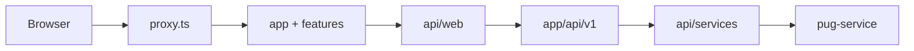

# PUG Web Admin

> 📦 Release: **v1.0.0**

`pug-web-admin` is the operational frontend for the PUG platform. It is a Next.js App Router application that gives administrators a browser-based workspace for the same business areas exposed by `pug-service`: academic, geo, identity, partner, and project. The repository combines protected UI flows, typed local API routes, typed backend service wrappers, and a command-center style dashboard for day-to-day platform operations.

## 🚀 Release 1.0.0

Release `1.0.0` marks the current stable admin-console surface implemented in the repository. This version provides protected route handling, session refresh behavior, domain workspaces for the main PUG modules, typed client/server API layers, translation tooling, and image/verification workflows for CI.

Main capabilities present in this release:

- protected admin workspace with login and refresh-token recovery
- module coverage for academic, geo, identity, partner, and project
- browser-facing `/api/v1/*` proxy routes with centralized auth retry behavior
- typed frontend data layer built on React Query and Zod
- container build and GitHub Actions verify/build/publish workflows

## ✨ Features

### Shared platform

- protected `/login` flow
- route protection through `proxy.ts`
- password-wired gating for protected app content
- command-center home dashboard
- local `/api/v1/*` route handlers for browser-safe backend access
- theme, locale, toast, and React Query provider stack

### Academic

- areas of expertise pages
- courses pages
- former-students pages

### Geo

- city directory pages

### Identity

- account pages
- admin pages
- user pages
- current-session oriented auth flows

### Partner

- entity pages
- staff pages

### Project

- project pages
- enrollment pages
- attendance pages

## 🏗️ Architecture overview

At a high level, `pug-web-admin` is a layered Next.js application. The browser does not call the backend service directly. Instead, client pages call the local `/api/v1/*` routes, those routes apply validation and auth-retry logic, and then typed backend service wrappers call the configured `NEXT_PUBLIC_API_URL`.

Core layers:

- **Route protection:** [proxy.ts](proxy.ts)
- **App Router shell:** [app/](app)
- **Feature pages:** [features/](features)
- **Client data layer:** [api/web/](api/web)
- **Browser-facing route handlers:** [app/api/v1/](app/api/v1)
- **Backend service wrappers:** [api/services/](api/services)



Important architectural properties:

- auth/session cookies are handled at the application boundary instead of only in client state
- the local `/api/v1/*` layer centralizes retry and error shaping
- React Query is the primary client caching and query orchestration layer
- Zod is used across route handlers and API utilities instead of trusting raw JSON

## 🧰 Tech stack

- **Framework:** Next.js 16 App Router
- **Language:** TypeScript
- **UI:** React 19, Tailwind CSS 4, Radix UI, Lucide, Sonner
- **Forms and validation:** React Hook Form + Zod
- **Client data:** TanStack React Query
- **State:** React context + Zustand
- **Localization:** i18next + `react-i18next`
- **Containerization:** Docker multi-stage build on `node:22-alpine`
- **Verification/tooling:** ESLint, Prettier, TypeScript compiler, translation scripts
- **CI/CD tooling:** GitHub Actions

## ▶️ Getting started

### Prerequisites

- Node.js `22` recommended to match CI
- npm
- a reachable backend at `NEXT_PUBLIC_API_URL` such as `pug-service` or `pug-mocks`

### Setup

Install dependencies:

```bash
npm ci
```

Create local environment configuration from [.env.example](.env.example), or set the variables directly.

### Environment variables

Discovered in the current codebase:

| Variable | Default / source | Purpose |
| --- | --- | --- |
| `NEXT_PUBLIC_API_URL` | `.env.example` -> `http://localhost:8080` | backend base URL |
| `NEXT_PUBLIC_APP_URL` | used in `app/layout.tsx`; not listed in `.env.example` | metadata base URL |

Mock-oriented environment file:

- [mock-api.env](mock-api.env) sets `NEXT_PUBLIC_API_URL=http://localhost:8090`

### Local run

Start the standard development server:

```bash
npm run dev
```

Start against the mock backend environment:

```bash
npm run dev:mock
```

Useful local commands:

```bash
npm run verify
npm run build
npm run start
```

## 📦 Version 1.0.0 Notes

- **Initial stable release:** this README documents the current `pug-web-admin` repository as release `1.0.0`
- **Main delivered modules/features:** protected admin shell, command-center home dashboard, typed local API proxy layer, typed backend integration, and domain workspaces for academic, geo, identity, partner, and project
- **Known limitations visible in the repo:**
  - a dedicated automated test suite was not found in the current codebase
  - `app/(app)/docs` exists as a route-group directory, but route files were not found there
  - `dev:mock` switches environment values, but a mock API bootstrap was not found in this repository
- **Compatibility/runtime expectations:**
  - Node.js `22` is the safest local choice because it matches CI
  - the application expects a backend reachable through `NEXT_PUBLIC_API_URL`
  - the production container runs on port `3000`

## 🗂️ Project structure

```text
pug-web-admin/
├── .github/
│   └── workflows/
├── api/
│   ├── services/
│   └── web/
├── app/
│   ├── (app)/
│   ├── (auth)/
│   └── api/v1/
├── auth/
├── components/
├── features/
├── public/
├── schemas/
├── scripts/
├── stores/
├── Dockerfile
├── next.config.ts
├── package.json
└── proxy.ts
```

## 🔗 Links to deeper documentation

- [Expanded workspace documentation](../pug-docs/pug-web-admin/README.md)
- [Architecture notes](../pug-docs/pug-web-admin/ARCHITECTURE.md)
- [Development notes](../pug-docs/pug-web-admin/DEVELOPMENT.md)
- [CI/CD notes](../pug-docs/pug-web-admin/CICD.md)

